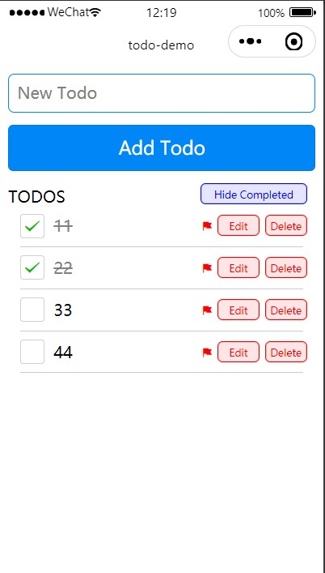

# TODO LIST

#### h5:

#### weapp:

### 项目描述

在顶端的输入框中输入待办事项，点击添加按钮就会将所有的待办事项展示在 TODOS 的下方，点击待办事项前面的方框，可以修改事件的完成状态，点击小旗子可以设置事项的优先级，点击 Edit 按钮可以修改已添加的 TODO，点击 Delete 按钮可以删除已添加的 TODO，点击 Hide Completed 按钮可以隐藏已完成的事项，点击 Show Completed 按钮可以将隐藏的事项显示出来。

### 优化点

1. 设置了可以显示/隐藏已完成事件的按钮；
2. 允许编辑已经添加的 todo（但只在 h5 中实现，微信小程序中还不能编辑）；
3. 文本过长时进行换行；

### 如何运行

1. npm install
2. npm run dev:weapp 或 npm run dev:h5

Github：https://github.com/Ancient1234/todo
